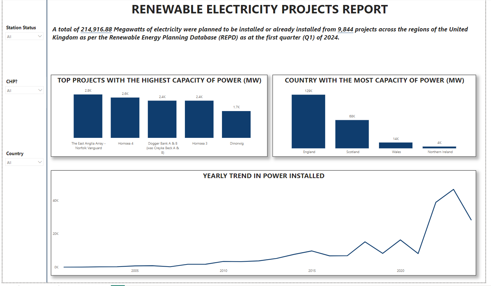

# RENEWABLE ELECTRICITY PROJECTS ANALYSIS


## TABLE OF CONTENTS
- [OBJECTIVES](#objectives)
- [DATA SOURCE](#data-source)
- [TOOLS](#tools)
- [DESIGN](#design)
- [STEPS](#steps)
  - [Algorithm Outline](#algorithm-outline)
  - [Data Exploration](#data-exploration)
  - [Data Cleaning](#data-cleaning)
  - [Creating SQL view for import into Power BI for visualization](#creating-sql-view-for-import-into-power-bi-for-visualization)
- [VISUALIZATION](#visualization)
  - [Results](#results)
  - [Dax Measures](#dax-measures)
- [ANALYSIS](#analysis)
- [RECOMMENDATIONS](#recommendations)
- [CONCLUSIONS](#conclusions)

## OBJECTIVES
This project contains data from the Renewable Energy Planning Database (REPD), managed by Barbour ABI on behalf of the Department of Business, Energy and Industrial Strategies (BEIS). The last update of the database was for the first quarter of 2024. It tracks the progress of renewable electricity projects in the United Kingdom from inception, through planning, construction, operation and decommissioning. It contains information on all Renewable Electricity and CHP (Combined Heat and Power) Projects in the United Kingdom. 

The project aims to analyse:
-  Regions with the most power projects
-  Trends in station capacity (power)
-  Station status (Operational or otherwise)
-  Regional breakdown of projects allocated and installed.

## DATA SOURCE
The data used for this project was pulled from the Renewable Energy Planning Database (REPD), the database has over 50 columns but I only needed to pull columns that had the following data: 
-  Project location
-  Operational status
-  Power capacity

The data for this project can be downloaded from the [Renewable Energy Planning Database (REPD)](https://www.gov.uk/government/publications/renewable-energy-planning-database-monthly-extract)

## TOOLS

| Tools             | Purpose                                                           |
|-------------------|-------------------------------------------------------------------|
| Microsoft Excel   | Data Exploration                                                  |
| SQL Server        | Data cleaning and transformation                                 |
| Microsoft Power BI| Data transformation and visualization via interactive dashboard |
| GitHub            | Hosting project documentation and version control                 |


## DESIGN

### Dashboard Requirements
The dashboard requirements formed the basis of my analysis, and they asked the following question:
-  Which project could deliver the most power?
-  Which country had the most power to be delivered to?
-  How many projects are operational compared to other statuses?
-  Which region had the most operational and non-operational projects?   


## STEPS
### Algorithm Outline
The general approach to the project is listed below:
-  Perform data extraction from the source systems or data repositories to retrieve the necessary datasets for analysis.
-  Transfer the extracted datasets into the SQL Server environment for storage and analysis
-  Perform data cleaning and transformation operations within the SQL Server environment to ensure the dataset's quality, integrity and consistency.
-  Create an SQL view to aggregate, transform, or subset the dataset in a manner conducive to analysis in Power BI.
-  Utilize Power BI to perform comprehensive analysis and visualization of the dataset
-  Analyze the insights from the data analysis and visualization process to generate actionable findings and recommendations.
-  Write comprehensive documentation for the project, including detailed explanations of the data sources, methodology, analysis techniques, results, and conclusions
-  Publish the project data and associated documentation to GitHub Pages for public access and dissemination.  


### Data Exploration
At first glance, the downloaded data from the [Renewable Energy Planning Database (REPD)](https://www.gov.uk/government/publications/renewable-energy-planning-database-monthly-extract) was about 3.58 MB in size with the table having over fifty columns ane more than ten thousand rows of data, the data was not consistent with formatting and it had missing values in some columns.

The data was accurate but incomplete due to the missing values. I immediately started thinking of ways to clean, correct and upgrade the data in terms of accuracy, quality, completeness and reliability.

The columns had the basic data needed as regards project location, operational status and power capacity, they just needed to be cleaned, prepared and properly formatted. 

### Data Cleaning
In context, Clean data should be consistent with uniform formats and standardized values, completeness is also ensured by having no missing values or handling them appropriately. Clean data should also be unique and be free of duplicates and only contain relevant information for analysis.

The aim was to refine the dataset to ensure proper structure and analysis. The clean data should meet the following requirements:
-  Only relevant columns should be retained.
-  All data types should be appropriate to the contents of each column.
-  The columns should not have null values, null or missing values should be handled properly and documented.
-  Rename columns with simple, correct, and readable names where possible.

####  Steps and SQL scripts for data cleaning
```SQL
--VIEW WHOLE TABLE
SELECT *
FROM repd_II;
GO
```

```SQL
-- REMOVE UNWANTED COLUMNS
SELECT
    Old_Ref_ID, Record_Last_Updated_dd_mm_yyyy, Operator_or_Applicant,
    Site_Name, Technology_Type, Storage_Type, Installed_Capacity_MWelec,
    CHP_Enabled, CfD_Allocation_Round, CfD_Capacity_MW, Turbine_Capacity_MW,
    No_of_Turbines, Mounting_Type_for_Solar, Development_Status_short,
    County, Region, Country, Post_Code, X_coordinate, Y_coordinate,
    Planning_Authority
FROM repd_II;
GO
```

```SQL
-- RENAME COLUMNS
SELECT
    Old_Ref_ID AS Ref_ID, Record_Last_Updated_dd_mm_yyyy AS Updated,
    Operator_or_Applicant AS Operator, Site_Name AS Site,
    Technology_Type AS Tech, Storage_Type AS Storage, 
    Installed_Capacity_MWelec AS 'Capacity Installed(MW)', CfD_Capacity_MW AS 'Capacity Agreed(MW)',
    CHP_Enabled AS 'CHP?', CfD_Allocation_Round AS 'Allocation Round',    
    No_of_Turbines AS Turbines,
    Development_Status_short AS Status,
    County, Region, Country,
    Post_Code, X_coordinate, Y_coordinate,
    Planning_Authority
FROM repd_II
WHERE Record_Last_Updated_dd_mm_yyyy is not null;
```

### Creating SQL view for import into Power BI for visualization

```SQL
-- CREATE VIEW
CREATE VIEW RENEWABLE AS
SELECT
	Old_Ref_ID AS Ref_ID, Record_Last_Updated_dd_mm_yyyy AS Updated,
	Operator_or_Applicant AS Operator, Site_Name AS Site,
	Technology_Type AS Tech, Storage_Type AS Storage, 
	Installed_Capacity_MWelec AS 'Capacity Installed(MW)', CfD_Capacity_MW AS 'Capacity Agreed(MW)',
	CHP_Enabled AS 'CHP?', CfD_Allocation_Round AS 'Allocation Round',	
	No_of_Turbines AS Turbines,
	Development_Status_short AS Status,
	County, Region, Country,
	Post_Code, X_coordinate,Y_coordinate,
	Planning_Authority
FROM repd_II
WHERE Record_Last_Updated_dd_mm_yyyy is not null
```


  
## VISUALIZATION
### Results

<p>
  
</p>
<p>
  
</p>
<p>
  
</p>


Three interactive dashboards were created

https://github.com/Tolulope-Faseyiku/renewable-electricity-projects-analysis/assets/143544753/501c67f3-ed2f-4acb-bef9-91b804c2c92f


### Dax Measures
Content for dax measures...

## ANALYSIS
Content for analysis...

## RECOMMENDATIONS
Content for recommendations...

## CONCLUSIONS
Content for conclusions...


